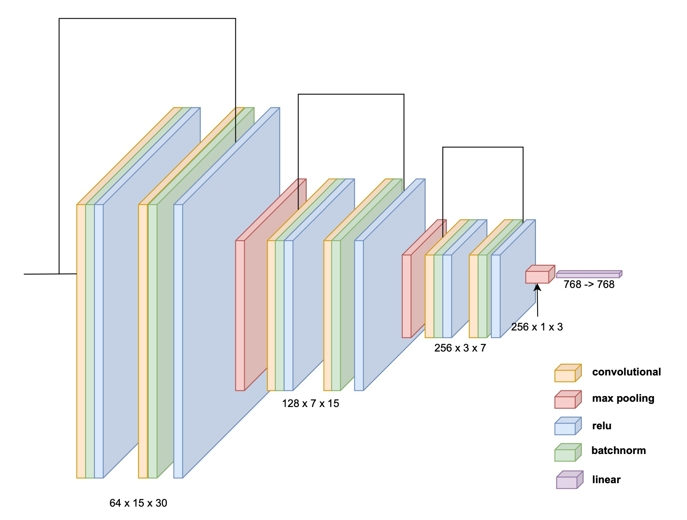

# 👀 VITRina: VIsual Token Representations

[](https://github.com/vitrina/actions/workflows/main.yaml)
[](https://github.com/psf/black)
[](http://mypy-lang.org/)


## Structure

- [`src`](./src) ‒ main source code with model and dataset implementations and code to train, test or infer model.
- [`notebooks`](./notebooks) ‒ notebooks with experiments and visualizations.
- [`scripts`](./scripts) ‒ different useful scripts, e.g. print dataset examples or evaluate existing models.
- [`tests`](./tests) ‒ unit tests.

## Requirements

Create virtual environment with `venv` or `conda` and install requirements:
```bash
pip install -r requirements.txt
```

For proper contributions, also use dev requirements:
```bash
pip install -r requirements-dev.txt
```

## Data

For data, we are using `.jsonl` format.
Each line is a JSON object with the following fields: `text`, `label`.
For example:

> {"text": "скотина! что сказать", "label": 1}

To train **tokenizer** on your data, use [`scripts.train_tokenizer`](./scripts/train_tokenizer.py) script:
```shell
python -m scripts.train_tokenizer \
  --data resources/data/dataset.jsonl \
  --save-to resources/tokenizer
```

### Visually noisy dataset

To generate noisy dataset, i.e. replace visually similar characters, use [`scripts.generate_noisy_dataset`](./scripts/generate_noisy_dataset.py) script
(see it for details about arguments):

```shell
python -m scripts.generate_noisy_dataset \
  --data resources/data/dataset.jsonl \
  --save-to resources/data/noisy_dataset.jsonl
```

For noisy dataset, each sample also contains information about class of each word. For example:

> {"text": [["cкотина", 0], ["!", 0], ["что", 0], ["сказать", 0]], "label": 1}

There are 4 levels of replacements:
1. Replace characters w/ visually similar numbers, e.g. "o" -> "0". Full mapping: [`letters1.json`](./resources/letter_replacement/letters1.json).
2. Replace characters w/ visually similar symbols or symbols from another language, e.g. "a" -> "@". Full mapping: [`letters2.json`](./resources/letter_replacement/letters2.json).
3. Replace characters w/ sequence of symbols, e.g. "ж" -> "}|{". Full mapping: [`letters3.json`](./resources/letter_replacement/letters3.json).
4. Replace characters w/ character from the same cluster.
Clustering is based on visual similarity between characters in the specified font.
Use [`scripts.clusterization`](./scripts/clusterization.py) to build clusters before applying augmentation to data.

### Toxic Russian Comments classification

Download dataset from Kaggle: [Toxic Russian Comments](https://www.kaggle.com/datasets/alexandersemiletov/toxic-russian-comments).
It is better to put it in `resources/data` folder.

Use [`scripts.prepare_ok_dataset`](./scripts/prepare_ok_dataset.py) to convert dataset to `.jsonl` format:
```shell
python -m scripts.prepare_ok_dataset \
  --data resources/data/dataset.txt \
  --save-to resources/data/dataset.jsonl 
```

Example:
```text
From: __label__INSULT скотина! что сказать
To: {"text": "скотина! что сказать", "toxic": 1}
```

## Models

For now, we are supporting 2 models:
1. Vanilla BERT model, see [`src.models.transformer_encoder`](./src/models/transformer_encoder) for implementation details.
2. VTR-based Transformer model, see [`src.models.vtr`](./src/models/vtr) for implementation details.
This model uses convolutions to extract features from visual token representations and passes them as embeddings for the vanilla Transformer.

Each model has 2 variants:
- Sequence classification via `[CLS]` token and MLP.
- Sequence labeling (suffix `SL`), where each token is passed to MLP.

You can study how convolutions on visual tokens works in [`src.models.vtr.embedder`](./src/models/vtr/embedder.py).


### Training

First of all, we are using `wandb` to log metrics and artifacts, so you need to create an account and login:
```shell
wandb login
```

To run training, use `src.main`:
```shell
python -m src.main --vtr --sl \
  --train-data resources/data/noisy_dataset.jsonl \
  --tokenizer resources/tokenizer
```

See
- [`src.main`](./src/main.py) for basic arguments, e.g. data paths, model type.
- [`src.utils.config`](./src/utils/config.py) for training, model, and vtr configurations.

## Results

### Toxic Russian Comments

- Sequence classification:

| Model | Accuracy | F1  | Precision | Recall |
|-------|----------|-----|-----------|--------|
| BERT  |          |     |           |        |
| VTR   |          |     |           |        |

- Sequence labeling:

| Model   | Accuracy | F1  | Precision | Recall |
|---------|----------|-----|-----------|--------|
| BERT-SL |          |     |           |        |
| VTR-SL  |          |     |           |        |
